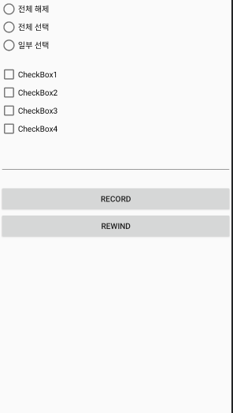

안녕하세요 유어슈 신입 여러분 Android Practice 레포에 온 것을 환영합니다

과제는 멀티모듈로 나눠놨으니 각자 하고 싶은 과제에 대해서 진행하시면 됩니다

레포를 받으신 후 본인의 develop 브렌치를 만들고 푸시합니다 develop-{nickname}
본인의 브렌치에서 새로운 브렌치를 따 작업을 시작하고 작업이 끝나면 add commit push 를 합니다

그리고 리뷰를 받고 싶다면 타겟을 본인의 develop 으로 해서 Pull Request 를 사용합니다
내용이 괜찮다면 본인의 브렌치에 머지를 하여 결과물을 기록하게 됩니다
master 에는 머지하지 않습니다

밑에 과제들은 참고된 링크를 잘 봐주세요

과제 1

    4개의 체크박스와 3개의 라디오 버튼이 서로 상호 동작하는 기능을 만든다 4개의 체크박스의 상태를 라디오 버튼이 표현하고 라디오 버튼을 누르면 4개의 체크박스 상태가 바뀌는 복합 동작
    문제 1. 4개의 체크박스와 radioButton (전체 해제, 전체 선택, 일부 선택) 버튼 3개 만들기. 일부선택 버튼은 클릭이 불가능하게 제작
    문제 2. CheckBox가 눌릴때 마다 MultiAutoCompleteTextView 에 Log기록 되는 것처럼 텍스트 누적되게 만들기 (ex. checkbox2 활성, checkbox3 해제)
    문제 3. 홈버튼을 눌러 나갔다가 앱을 다시 들어올 때 로그 초기화
    문제 4. 체크박스 선택여부에 맞게 radioButton 변경 radioButton 클릭에 따라 체크박스 변경. 단, 일부선택은 눌리지 않게 한다. 이용약관 처럼 만들기 (ex. 4개 전부 눌렀을 때 전체 선택 radioButton이 활성화, 1,2,3개 눌렀을 때 일부 선택이 활성화, 0개 눌렀을 때 전체해제 활성화)
    문제 5. 레코드, 리와인드 버튼 2개 생성하고 레코드 버튼을 누른 시점의 {체크박스, 라디오 버튼}을 기억해 뒀다가 리와인드 버튼을 누를때 해당 활성화 내용으로 돌아가기
    
    
과제 2

    계산기 만들기
    
    복합연산은 하지 않고 연산자를 누를때마다 계산한 값이 반영되도록 한다
    버튼은 숫자 0~9 까지 +, -, *, / 연산자 버튼, +/- 전환 버튼, % 버튼, = 버튼 총 19개의 버튼으로 구성한다
    
    추과과제(optional) 위의 사진은 아이폰 모양으로 만들어본 예시입니다
    혹은 이것보다 기발하고 좀 어려운 디자인이면 칭찬 해드립니다 ㅎㅎ 
    
과제 3

    과제3
    asset에 10개의 이미지를 저장하고 랜덤의 순서로 RecyclerView를 이용해서 세로 방향으로 이미지 리스트를 띄워라.
    리사이클러뷰의 아이템은 아래 사진처럼 이미지와 제목으로 구성되어 있다.
    이미지를 길게 누르면 파일의 이름이 AlertDialog로 출력되며, 화면 스크롤이 끝까지 닿은 경우 또 다시 랜덤의 순서로 이미지가 재배열된다.
    
과제 4

    bottom navigation + 프래그먼트 4개로 SharedPreference 와 같이 사용하여 구현하기
    첫번째 탭 : 사용자 이름 입력
    두번째 탭 : 사용자 생일 입력
    세번째 탭 : 학교, 학번
    네번째 탭 : 1,2,3 번 탭에서 입력한 정보 한번에 보여주기
    탭을 이동해도 사용자 정보가 유지되도록 만들기 방법은 자유

과제 5

[앱 권한 요청](https://developer.android.com/training/permissions/requesting?hl=ko)

[갤러리에서 이미지 불러와 이미지뷰에 보여주기](https://webnautes.tistory.com/1302)

[RxPermissions](https://github.com/tbruyelle/RxPermissions)

    화면에는 이미지뷰를 만든다.
    이미지뷰를 클릭하면 Intent를 이용해 사용자 휴대폰의 갤러리에서 이미지를 선택하고, 선택한 이미지를 이미지뷰에 띄워준다.
    안드로이드 SDK 26 (6.0 Marshmallow) 이후부터는 사용자의 휴대폰에 있는 파일을 불러오기 위해서는 권한을 허락 받아야 한다.
    
    추가과제(optional) - 권한 허가 부분을 RxPermissions 를 이용하여 리팩토링하시오. 
    
과제 6

    이전에 했던 과제 내용 중 본인이 원하는 것을 골라서 databinding 을 활용하는 내용으로 만들어본다
    추가과제(optional) - MVVM 패턴으로 리팩토링 해본다
    
클론코딩 1

    그라운드의 홈화면을 그대로 만들어 본다 모양만 배낀다. 데이터는 더미데이터를 사용한다.
    구체적인 수치는 ground-android 피그마를 참고한다.

restful api 1

[공공데이터 센터](https://www.data.go.kr/)
[공공데이터 센터 api 발급 예시](https://jeong-pro.tistory.com/m/143)

    공공데이터 센터 에 접속해서 open api 를 찾는다 json 형태로 발급 받아야 한다 (xml 형태는 제외한다)
    발급예시를 보고 api 를 발급 받는 법을 참고 바람
    
    사용 할 라이브러리 - retrofit2, okhttp3 (강제) + rxjava (옵션)
    
    어떤 api던지 자유롭게 선택하되(가급적 내용이 많고 리스트로 나오는걸로) 과제는
    1. 화면에 recyclerview를 만들고 데이터 30개를 가져와서 화면에 뿌려준다
    2. 스크롤을 최하단으로 내리면 다시 데이터 30개를 가져와서 기존 리스트에 추가한다 (데이터가 더이상 없을때까지 반복)